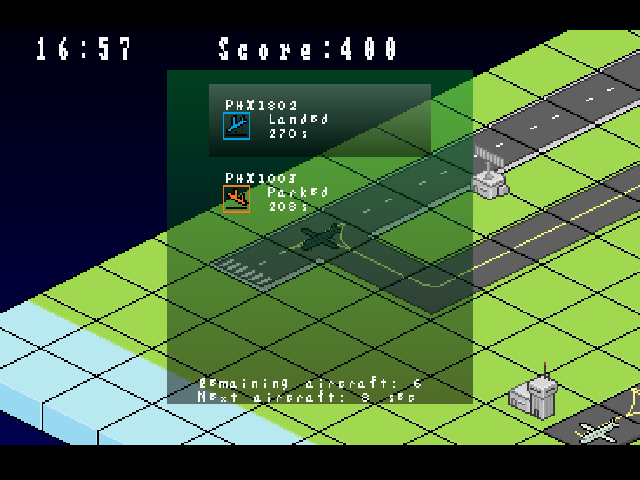
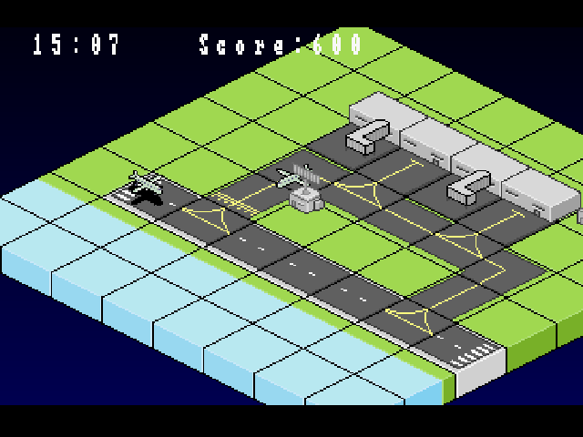

# Airport
A free (as in free speech) video game for the original PlayStation written
with [PSXSDK](https://github.com/XaviDCR92/psxsdk).




## Overview
`Airport` is a free (as in freedom) video game for the original Sony
Playstation aka PSX. The player puts himself/herself in the role of an Air
Traffic Controller (ATC) where inbound and outbound flights must be brought to
their destinations safely and within time.

While aiming for an arcade experience, `Airport` is inspired by real-world
procedures used in aviation so those used to realistic flight simulators might
enjoy this video game as well. While many features are still missing, the game
is in a rather playable state.

`Airport` is written in C using the `mipsel-unknown-elf` GNU toolchain and a
free SDK called PSXSDK, created by nextvolume. Since the original author stopped
developing it, a [custom version of the SDK](https://github.com/XaviDCR92/psxsdk),
bringing in new features and bugfixes, is used for this project. A map editor
is also available for operating systems supporting `Qt`.

The game has been successfully tested under real hardware (`SCPH-5502` and
`SCPH-102`), `pcsxr`, `pSX` and `FPSe` without major issues. It is also
compatible with [OpenSend](https://github.com/XaviDCR92/OpenSend), making it
possible to stream game data from a computer over the serial port on the
console, allowing quicker development under real hardware.

## Running Airport from a prebuilt image

Prebuilt images for common use can be found for each
[release](https://github.com/XaviDCR92/Airport/releases). These images are
tipically distributed as a `.bin`/`.cue` file pair that can be used by most
PSX emulators out there, and can be also burnt into a CD-r and run under
real hardware.

## How to build
`Airport` has moved from a `Makefile`-based build system towards `cmake` for
convenience, easier deployment and generation of `compile_commands.json`,
useful for improved text completion on some IDEs. `cmake >= 3.13` is required.
Before building, environment variable `PSXSDK_PATH` must be set to the path
where `psxsdk` has been installed (e.g.: `/usr/local/psxsdk`).

`Airport` can then be built using the typical process in CMake projects:

```sh
mkdir build && cd build/
cmake .. -DCMAKE_EXPORT_COMPILE_COMMANDS=1
cmake --build .
```

Once built, two files namely `airport.bin` and `airport.cue` inside the build
directory (e.g.: `build`) can be used to play the game on an emulator or burn
it into a CD-R to play it into a modchipped console.

On the other hand, the map editor must be built using the Qt framework. Qt
Creator automates the process and thus is the recommended way to go.

## License
`Airport` is licensed under the GPLv3 or later (read `LICENSE`) unless noted
otherwise. Some assets with various permissive licenses are also used - see
`LICENSE` files on each subfolder for further reference.
